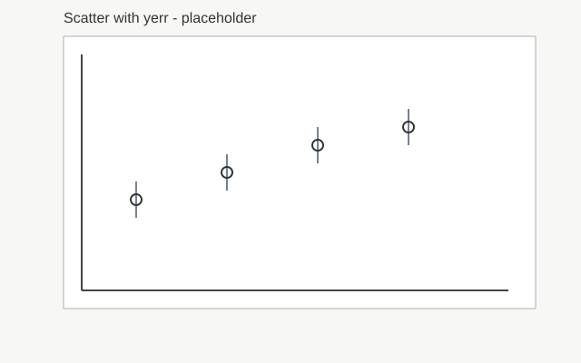
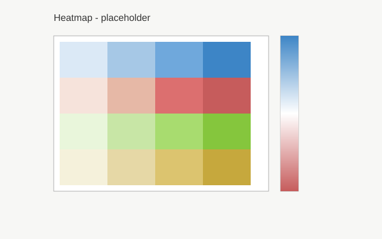

# graphics.py – Scientific Visualization

## Purpose

High-level scientific visualization based on the universal `plot()` function. Express **what you want to visualize** and the engine decides **how to render it**. Supports measurements with uncertainty, symbolic functions, 2D/3D plots, heatmaps, surfaces, and complex multi-panel layouts.

---

## The Main Interface: `plot()`

```python
plot(*objetos, mode=None, layout=None, dims="2D", show=True, figsize=None,
    figure=None, subplot=None, xlabel=None, ylabel=None, zlabel=None, title=None, 
    colors=None, **kwargs)
```

**Parameters:**
- `*objetos`: Data objects, quantities, Functions, arrays, or semantic types
- `mode`: Visualization mode: `"scatter"` (default), `"line"`, `"heatmap"`, `"surface"`
- `dims`: `"2D"` (default) or `"3D"` for 3D visualization
- `show`: Display the plot (default `True`)
- `figsize`, `xlabel`, `ylabel`, `title`: Standard plot parameters
- `figure`: Integer id to group multiple calls into the same figure
- `subplot`: Subplot index (1..N) inside the grouped figure (requires `figure`)
- `colors`: Color mapping for experimental groups or single series:
  - `None` (default): Automatic theme colors
  - `"color_name"`: Single color for all series/groups
  - `{"group_name": "color", ...}`: Map each group to a color (requires groups)
- `**kwargs`: Style customization (linestyle, linewidth, markersize, etc.)

**Returns:** `(fig, ax)` tuple

---

## Quick Start: Plotting with Quantities

Use `marhare.quantity()` to create measurements with uncertainty and units:

```python
import marhare as mh
import numpy as np

# Create arrays of measurements with uncertainty
length = mh.quantity([5.20, 5.23, 5.25], [0.05, 0.05, 0.05], "m", symbol="L")
time = mh.quantity([2.08, 2.10, 2.12], [0.1, 0.1, 0.1], "s", symbol="t")

# Plot directly – auto-labels with symbol and unit
mh.plot(length, time, title="Measurement")
# X-axis: "L [m]", Y-axis: "t [s]"
```

You can also plot single scalar measurements (automatically wrapped as single-point series):

```python
# Single measurements
length = mh.quantity(5.23, 0.05, "m", symbol="L")
time = mh.quantity(2.1, 0.1, "s", symbol="t")
mh.plot(length, time, title="Measurement")  # Creates a 1-point scatter plot
```

---

## Core Visualization Modes

### 1. **Default (Scatter) Mode**

Plot points from arrays or quantities:

```python
x = np.array([1, 2, 3, 4])
y = np.array([2, 4, 5.5, 8])

# Simple scatter
mh.plot(x, y, title="Data Points")

# With error bars (two equivalent syntaxes)
sy = np.array([0.3, 0.2, 0.4, 0.3])
mh.plot(x, y, yerr=sy, title="Data with Uncertainty")
mh.plot(x, y, sy=sy, title="Data with Uncertainty")  # alias for yerr
```



### 2. **Line Mode: Smooth Curves**

Use `mode="line"` for continuous curves, or pass a `Function`:

```python
# Fitted curve
x_fit = np.linspace(0, 5, 100)
y_fit = 2 * x_fit + 1

mh.plot(x, y, mode="scatter")  # Data
mh.plot(x_fit, y_fit, mode="line", label="Linear fit")  # Curve
```

### 3. **Function Mode: Symbolic Evaluation**

Pass a symbolic `Function` – it auto-evaluates on a 400-point dense grid:

```python
from marhare import Function

x = np.linspace(0, 2*np.pi, 50)
f = Function("sin(x)")
g = Function("cos(x)")

# Functions auto-evaluate over the x range
mh.plot(x, f, label="sin(x)")
mh.plot(x, g, label="cos(x)", mode="line")
```

### 4. **Heatmap Mode: 2D Data**

Visualize 2D matrices with color mapping:

```python
# Create a 2D matrix (e.g., image or temperature field)
Z = np.random.randn(10, 10)

# Method 1: mode parameter (automatically includes colorbar)
mh.plot(Z, mode="heatmap", title="2D Heatmap", figsize=(8, 6))

# Method 2: Semantic object
from marhare.graphics import Heatmap
hm = Heatmap(Z)
mh.plot(hm, title="2D Heatmap")
```



**Parameters:** `cmap` (colormap, default 'viridis'). Colorbar is added automatically.

### 5. **Surface Mode: 3D Mesh**

Render 3D surfaces from 2D data:

```python
# 2D array → 3D surface
Z = np.sin(np.linspace(0, 3, 30)[:, None]) * np.cos(np.linspace(0, 3, 30))

# Method 1: mode parameter + dims="3D"
mh.plot(Z, mode="surface", dims="3D", title="3D Surface")

# Method 2: Semantic object
from marhare.graphics import Surface
surf = Surface(Z)
mh.plot(surf, dims="3D", title="3D Surface")
```

---

## Advanced: Working with Quantities

### Auto-Labeled Axes

Quantities automatically format labels as `"symbol [unit]"`:

```python
import marhare as mh

# Create a measurement series
x_vals = [10, 20, 30, 40]
x_unc = [0.5, 0.5, 1.0, 1.0]
x_qty = mh.quantity(x_vals, x_unc, "cm", symbol="x")

y_vals = [5.2, 10.1, 15.3, 20.0]
y_unc = [0.2, 0.2, 0.3, 0.3]
y_qty = mh.quantity(y_vals, y_unc, "s", symbol="t")

# X-axis shows "x [cm]", Y-axis shows "t [s]"
mh.plot(x_qty, y_qty, title="Time vs Distance")
```

### Functions with Quantities

Combine symbolic expressions with measured data. The cleanest approach uses quantities directly, which auto-labels axes:

```python
import marhare as mh
import numpy as np

# Measured voltage and current
V = mh.quantity([1.0, 2.0, 3.0], [0.1, 0.1, 0.1], "V", symbol="V")
I = mh.quantity([0.2, 0.4, 0.6], [0.01, 0.01, 0.01], "A", symbol="I")

# Plot measured data directly – quantities auto-extract values and errors
mh.plot(I, V, title="Voltage vs Current")  # Auto-labels "I [A]" and "V [V]"

# Plot with a fitted line overlay using figure and subplot
x_fit = np.linspace(0.1, 0.7, 50)
y_fit = 5 * x_fit  # Theory: R = 5Ω

mh.plot(I, V, label="Measured", figure=1, subplot=1, show=False, title="V-I Curve with Theory")
mh.plot(x_fit, y_fit, mode="line", label="R=5 ohm", figure=1, subplot=1)
# Auto-labels from quantity symbols and units: "I [A]" and "V [V]"
```

If you need to extract values for data processing, manually specify labels:

```python
from marhare.uncertainties import value_quantity

# Extract values and errors for processing
I_val, I_err = value_quantity(I)
V_val, V_err = value_quantity(V)

# When using raw values, you must specify labels manually
mh.plot(
    I_val, V_val,
    yerr=V_err,
    label="Measured",
    xlabel="I [A]",
    ylabel="V [V]",
    figure=1,
    subplot=1,
    show=False,
    title="V-I Curve with Theory"
)
mh.plot(x_fit, y_fit, mode="line", label="R=5 ohm", figure=1, subplot=1)
```

### Experimental Groups: Auto-Detection with Color Mapping

When quantities contain **experimental groups** (multiple realizations of the same physical magnitude), `plot()` automatically detects and visualizes them as colored series on the same subplot:

```python
import marhare as mh

# Two experimental measurements of wavelength (two experimental runs)
wavelength = mh.quantity(
    groups={
        "red_light": ([600, 605, 610], [2, 2, 2]),  # Measured red light wavelengths
        "blue_light": ([450, 452, 451], [3, 3, 3])  # Measured blue light wavelengths
    },
    unit="nm",
    symbol="λ"
)

# Refractive index for each group
n = mh.quantity(
    groups={
        "red_light": ([1.50, 1.51, 1.49], [0.05, 0.05, 0.05]),
        "blue_light": ([1.52, 1.53, 1.51], [0.05, 0.05, 0.05])
    },
    unit="",
    symbol="n"
)

# Single plot command – automatically creates colored series (red, blue)
mh.plot(wavelength, n, title="Refractive Index vs Wavelength")
```

**Behavior:**
- Both `λ` and `n` have matching group names (`"red_light"`, `"blue_light"`)
- All groups are drawn on the **same subplot** with automatic colors from the theme
- Legend shows group names ("red_light", "blue_light")
- Axes are auto-labeled from quantity symbols and units: `"λ [nm]"` and `"n [1]"`

**With custom colors:**

```python
# Apply specific colors to each group
mh.plot(wavelength, n, colors={
    "red_light": "#FF0000",
    "blue_light": "#0000FF"
})

# Single color for all groups
mh.plot(wavelength, n, colors="#FF5500")
```

**Color parameter rules:**
- `colors=None` (default): Use automatic color cycle
- `colors="color_name"`: Apply single color to all groups
- `colors={"group1": "color1", "group2": "color2", ...}`: Map each group to a color
- `colors=[...]` (list/array): Error when groups are present (ambiguous)

**Edge cases:**
- If only `y` has groups and `x` doesn't: groups are applied to `y` rows
- If `x` and `y` have different group names: Error (groups must match)
- Mismatched groups raise `ValueError` with details

---

## Grouping Multiple Plots with `figure` and `subplot`

Use `figure` (int id) to group multiple `plot()` calls into the same Matplotlib figure,
and `subplot` to specify which panel (1..N) each call targets.

**Overlay on same axis:**

```python
import marhare as mh
import numpy as np

x = np.linspace(0, 10, 50)

# Both lines are drawn on the same subplot
mh.plot(x, np.sin(x), mode="line", label="sin(x)", figure=1, subplot=1, show=False)
mh.plot(x, np.cos(x), mode="line", label="cos(x)", figure=1, subplot=1)
# Single plot with two overlaid curves and shared legend
```

**Multiple panels in one figure:**

```python
# Specify layout once (on first call)
# Then use subplot to target each panel

mh.plot(x, np.sin(x), mode="line", figure=2, subplot=1, layout="1x2", 
        title="sin(x)", show=False)

mh.plot(x, np.cos(x), mode="line", figure=2, subplot=2, layout="1x2", 
        title="cos(x)", show=False)

mh.plot(x, np.tan(x), mode="line", figure=2, subplot=3, layout="2x2", 
        title="tan(x)")  # This one shows the figure
```

**Rules:**
- `figure`: Integer identifier (e.g., `1`, `2`, `100`). Each unique id creates or reuses a figure
- `subplot`: Index (1..N) inside the grouped figure. Must be used with `figure`
- `layout`: Explicit layout like `"1x2"`, `"2x2"`, etc. Set on first call to `figure`
- Multiple calls to the same `(figure, subplot)` pair draw on the same axis (overlay)
- `show=True` (default) displays immediately; use `show=False` to defer display until the final call

**Common workflow:**

```python
# Build multi-panel figure step by step
for i, experiment in enumerate(experiments, 1):
    x_data, y_data = experiment
    mh.plot(x_data, y_data, figure=10, subplot=i, layout="2x2", 
            title=f"Exp {i}", show=(i == 4))  # Show only on last call
```

---

## Semantic Objects (Alternative Interface)

For explicit control, use semantic classes:

- **`Series(x, y, label=None, marker=None)`** – Scatter points
- **`SeriesWithError(x, y, sy=None, sx=None, label=None)`** – Points with error bars
- **`Fit(x, yfit, label=None)`** – Smooth fitted curve
- **`Band(x, y_low, y_high, label=None)`** – Shaded confidence band
- **`Histogram(data, bins=30, label=None)`** – Histogram
- **`Series3D(x, y, z, label=None)`** – 3D scatter points
- **`Heatmap(Z, colorbar=True, cmap=None)`** – 2D matrix visualization
- **`Surface(Z, cmap='viridis')`** – 3D mesh surface

You can pass these semantic objects directly to `plot()`. `Panel` and `Scene`
are available for advanced, reusable layouts, but most workflows do not need them.

---

## Panel and Scene (advanced)

Use `Panel` and `Scene` only if you need a reusable layout object or want to
bundle multiple semantic objects into a single subplot explicitly.

---

## Style Customization

All style options from `PLOT_DEFAULTS` can be overridden:

```python
mh.plot(x, y, 
    color='red', 
    marker='s',           # square marker
    linestyle='--',       # dashed line
    linewidth=2,
    markersize=8,
    grid=True,
    legend=True
)
```

---

## Practical Examples

### Example 1: Experimental Data with Fit

```python
import marhare as mh
import numpy as np

# Experimental measurements
x_exp = mh.quantity([1, 2, 3, 4], [0.1, 0.1, 0.1, 0.1], "m", symbol="x")
y_exp = mh.quantity([2.1, 4.0, 5.9, 8.2], [0.3, 0.3, 0.4, 0.4], "s", symbol="t")

# Fitted model
x_fit = np.linspace(0.5, 4.5, 100)
y_fit = 2.05 * x_fit - 0.05

mh.plot(
    x_exp, y_exp,
    x_fit, y_fit, mode="line", label="Linear fit",
    title="Kinematics: Position vs Time"
)
```

### Example 2: 2D Heat Distribution

```python
# Temperature field
T = 25 + 10*np.sin(np.linspace(0, np.pi, 50)[:, None]) * \
        np.cos(np.linspace(0, np.pi, 50))

mh.plot(T, mode="heatmap", title="Temperature Distribution [°C]", figsize=(8, 6))
```

### Example 3: Function Family

```python
x = np.linspace(0, 10, 200)

# Multiple symbolic functions
f1 = mh.Function("sin(x)", vars=["x"])
f2 = mh.Function("sin(x/2)", vars=["x"])
f3 = mh.Function("sin(2*x)", vars=["x"])

mh.plot(x, f1, label="sin(x)", mode="line")
mh.plot(x, f2, label="sin(x/2)", mode="line", linestyle='--')
mh.plot(x, f3, label="sin(2x)", mode="line", linestyle=':')
```

---

## Visualization Decision Tree

```
Do you have...
├─ Arrays (x, y)? → Use default scatter or mode="line"
├─ Uncertainties (σ)? → Quantities auto-label axes
├─ Symbolic expression? → Use Function class, auto-evaluates
├─ 2D matrix (Z)? → Use mode="heatmap" or Heatmap object
├─ 3D surface? → Use mode="surface" or Surface object
├─ Multiple plots? → Use figure and subplot arguments
└─ Error bars + fit + residuals? → Combine semantic objects
```

---

## Common Patterns

| Task | Code |
|------|------|
| Simple scatter | `plot(x, y)` |
| Scatter + error bars | `plot(x, y, yerr=sy)` or `plot(x, y, sy=sy)` |
| Smooth curve | `plot(x, y_fit, mode="line")` |
| Symbolic function | `plot(x, Function("sin(x)"))` |
| With quantities | `plot(qty_x, qty_y)` → auto-labels |
| Experimental groups (auto-detect) | `plot(qty_with_groups, qty_with_groups)` → colored series |
| Color groups explicitly | `plot(qty_x, qty_y, colors={"group1": "#FF0000", ...})` |
| 2D matrix | `plot(Z, mode="heatmap")` |
| 3D surface | `plot(Z, mode="surface", dims="3D")` |
| Overlay on same subplot | `plot(..., figure=1, subplot=1, show=False); plot(..., figure=1, subplot=1)` |
| Multiple panels (1x2) | `plot(..., figure=2, subplot=1, layout="1x2", show=False); plot(..., figure=2, subplot=2)` |
| Multiple panels (2x2) | `plot(..., figure=3, subplot=i, layout="2x2", show=(i==4))` for i in 1..4 |
| Multiple semantic objects | `plot(Panel(...), Panel(...), layout=(1,2))` |

